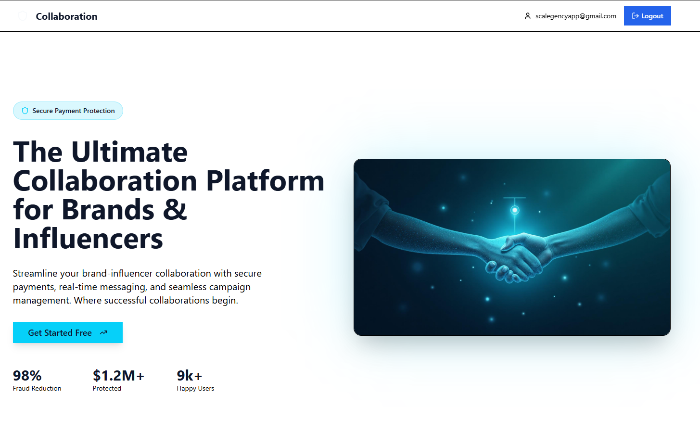
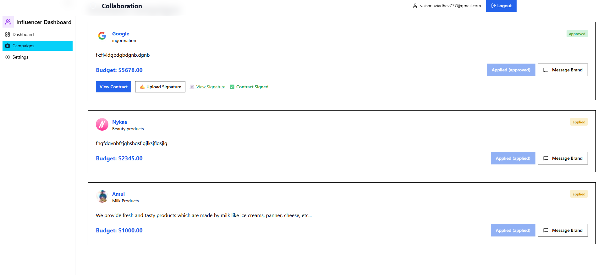
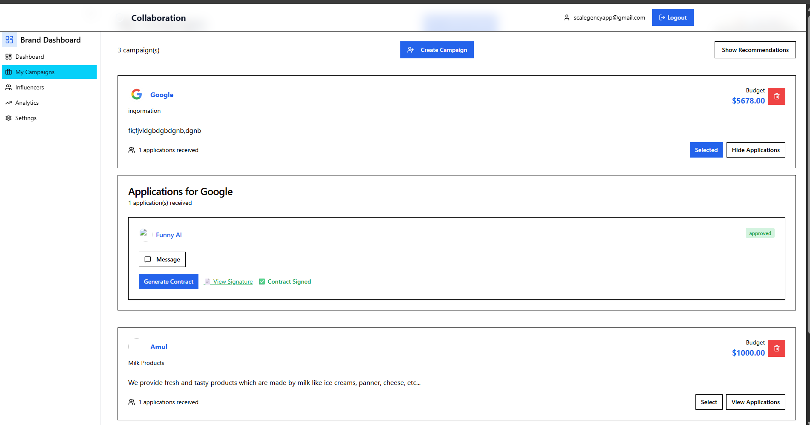
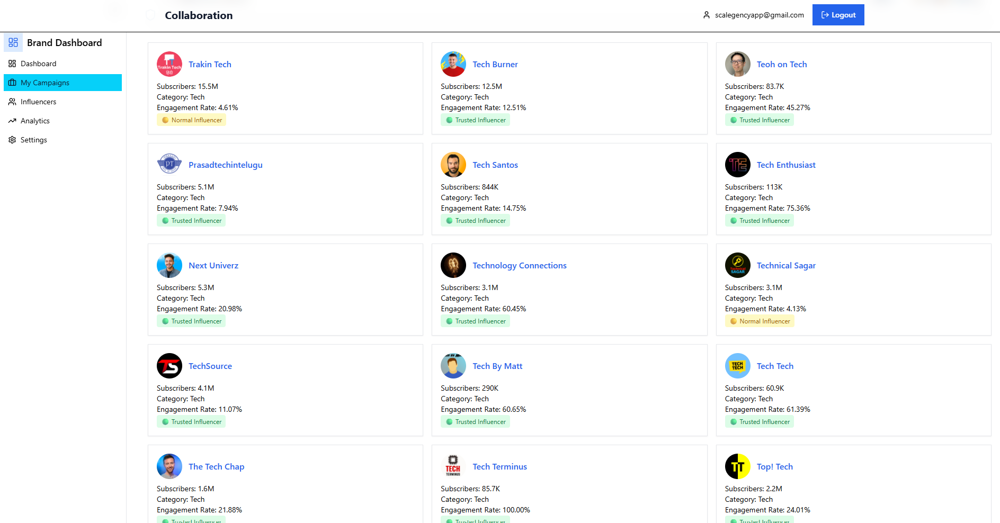

# 🤝 Brand Influencer Collaboration Platform

A full-stack MERN platform that connects brands and influencers for campaign management, collaboration, and communication.

## 🚀 Live Demo

🌐 https://brands-and-influencers-collaboration.vercel.app

## ✨ Features

- Brand Dashboard
- Influencer Dashboard
- Campaign Creation
- Campaign Applications
- Real-Time Messaging
- Authentication & Authorization
- Firebase Database Integration
- Profile Management
- Responsive Design

## 🛠️ Tech Stack

- React.js
- Node.js
- Express.js
- Firebase Firestore
- Firebase Authentication
- Tailwind CSS
- REST APIs

## 📸 Screenshots

  
  

  
  

## 📂 Installation

bash
git clone https://github.com/sakshispatil36/Brand-Influencer-Collaboration.git
cd Brand-Influencer-Collaboration
npm install
npm start
